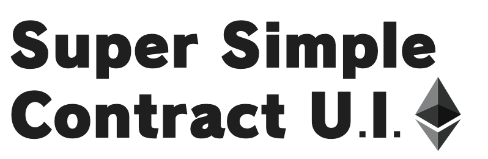

# Smart Contract Interaction using alternative Front End

<h4 align="center">
  <a href="https://shortcut-sc-nextjs.vercel.app/">Website</a>
</h4>

Background

This webpage serves as a quick tool for users who wish to interact directly with smart contracts, particularly in instances where there may be a front-end failure for dApps. While several applications exist for interacting with smart contracts, the author believes there should be a simpler and, ideally, faster method to transact with the blockchain. Blockchains, such as Ethereum, have been operating continuously since their inception, and so does the importance of a shortcut for transactions when it's needed most.

⚙️ Built using NextJS, RainbowKit, Hardhat, Wagmi, Viem, and Typescript.

## Requirements

Before you begin, you need to install the following tools:

- [Node (>= v18.17)](https://nodejs.org/en/download/)
- Yarn ([v1](https://classic.yarnpkg.com/en/docs/install/) or [v2+](https://yarnpkg.com/getting-started/install))
- [Git](https://git-scm.com/downloads)

## Quickstart

This repo uses the same format as Scaffold-ETH 2, you can find similar steps below from the original repo:

1. Clone this repo & install dependencies

```
git clone https://github.com/muhammadaus/SuperSimpleContractUI.git
cd SuperSimpleContractUI
yarn install
```

2. Run a local network and deploy contract to the local network:

This will have the same steps from the original repo and only needed if you want to test contracts locally.

Original repo: <a href="https://github.com/scaffold-eth/scaffold-eth-2">Scaffold Eth 2</a>

3. Start your NextJS app:

```
yarn start
```

Visit your app on: `http://localhost:3000`. You can interact with your smart contract using the `Read/Write Contracts` page.

# Main Page

This project is a front end that can interact with any smart contracts. You just need the smart contract address, the ABI, and the network it is deployed to. Load the necessary contract address, ABI, and network selection.
Read/Write Page

# Read/Write Page

The smart contract will be read/written using RPC connected from the browser wallet. The necessary parameters are unlike typical web3 frontends which require the exact input from smart contracts. Ensure that the number of parameters passed is exactly as in the function of the smart contracts.

    Read: Insert the required address or parameters to read a function.
    Write: Insert the necessary parameters to write into the blockchain, such as sending ether, making a swap, or minting an NFT.

## PureContracts

PureContracts is a smart contract interaction platform that provides an easy way to interact with EVM contracts. It now supports EIP-7702 batch transactions through Foundry integration.

### Features

- Load any contract with its ABI
- Detect contract types automatically (ERC20, ERC721, Bridge, Liquidity Pool, etc.)
- Execute single and batch transactions
- Support for EIP-7702 batched transactions via Foundry
- MetaMask-like transaction preview

### EIP-7702 Support

This project now includes support for EIP-7702 (Account Abstraction) which allows:

1. Batch multiple transactions in a single transaction
2. Gas sponsorship - one account can pay gas for transactions executed by another account
3. Delegated execution - sign a transaction and let another account execute it

## Setup

### Prerequisites

- Node.js (>= 18)
- Yarn
- Foundry (for EIP-7702 support)

### Installation

1. Clone the repository
```bash
git clone https://github.com/your-username/PureContracts.git
cd PureContracts
```

2. Install dependencies
```bash
yarn install
```

3. Install Foundry for EIP-7702 support
```bash
# Run the installation script
chmod +x packages/nextjs/scripts/install-foundry.sh
packages/nextjs/scripts/install-foundry.sh

# Or install manually
curl -L https://foundry.paradigm.xyz | bash
foundryup
```

4. Start the development server
```bash
yarn dev
```

## Testing EIP-7702 Features

1. Start a local Anvil node with Prague hardfork support:
```bash
anvil --hardfork prague
```

2. Run the Foundry tests to verify EIP-7702 functionality:
```bash
forge test -vv
```

3. Execute the sample batch transaction script:
```bash
forge script script/BatchTransactions.s.sol --broadcast --rpc-url http://localhost:8545 --hardfork prague
```

## Using the App

1. Start the development server:
```bash
yarn dev
```

2. Visit `http://localhost:3000` in your browser

3. Load a contract by entering its address and ABI

4. Add operations to the batch by using the "Add to Batch" button on different contract operations

5. Execute the batch using the "Execute Batch" button

## Development

### Folder Structure

- `packages/nextjs`: Next.js application
  - `app`: Application pages
  - `components`: React components
  - `utils`: Utility functions including batch execution
  - `utils/foundry`: Foundry integration for EIP-7702
  - `api`: API routes including Foundry execution endpoint

### Environment Variables

Create a `.env.local` file in the `packages/nextjs` directory with the following variables:

```
NEXT_PUBLIC_DEFAULT_CHAIN_ID=1
# Optional: Use for testing Foundry integration
PRIVATE_KEY=your_private_key
```

### Contributing

1. Fork the repository
2. Create your feature branch (`git checkout -b feature/amazing-feature`)
3. Commit your changes (`git commit -m 'Add some amazing feature'`)
4. Push to the branch (`git push origin feature/amazing-feature`)
5. Open a Pull Request
